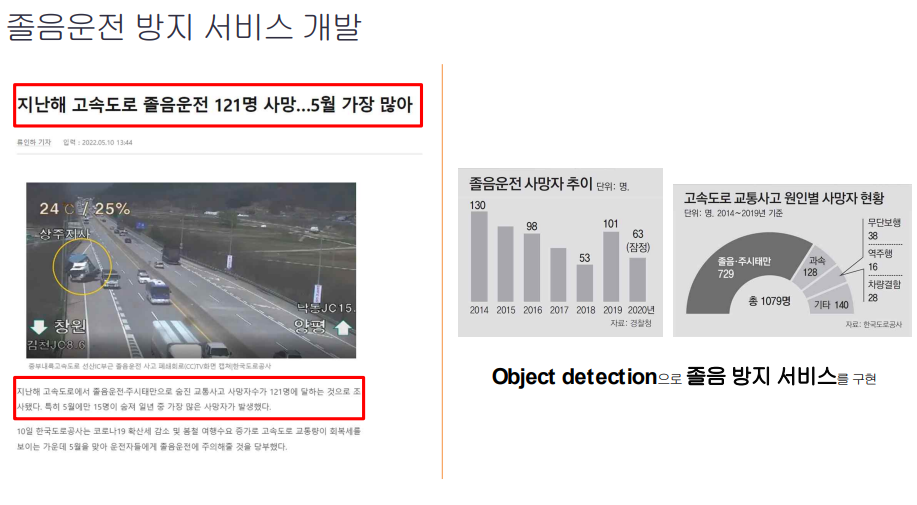
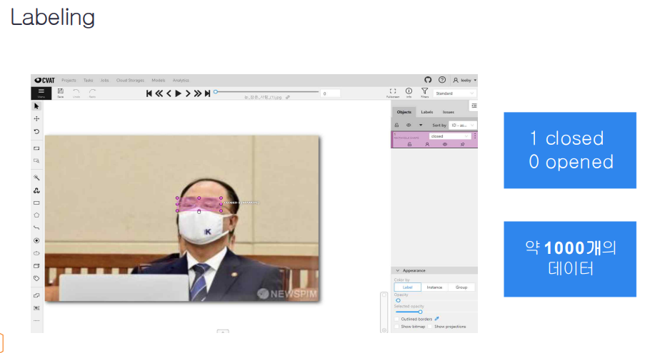
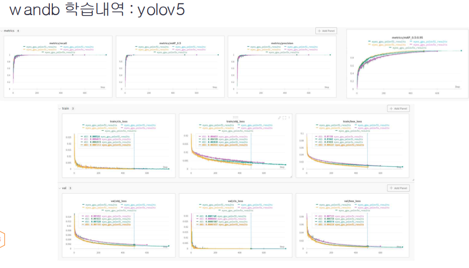
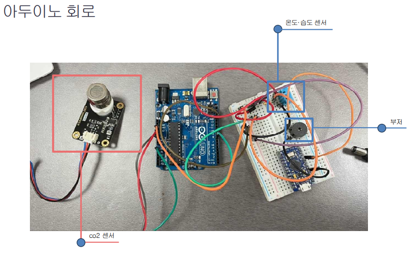
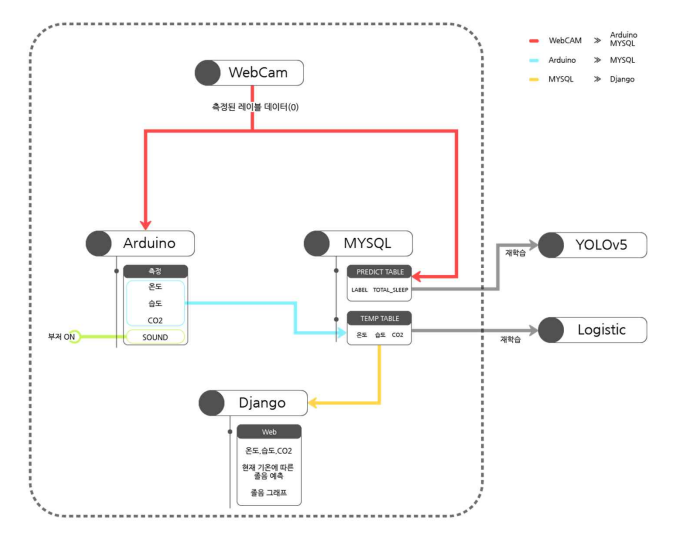
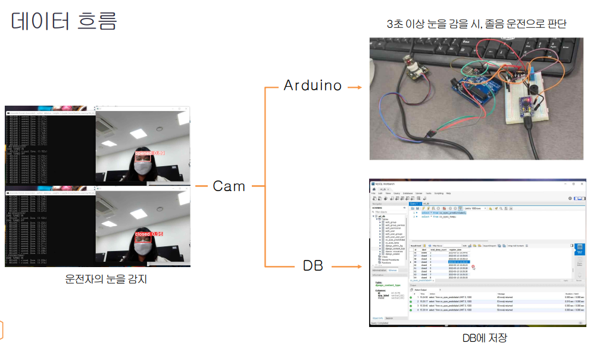
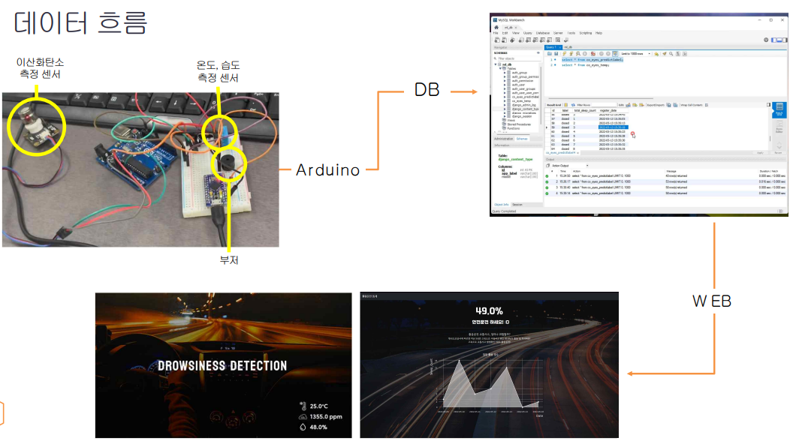

# 운전자 졸음 탐지와 졸음 환경 감지 서비스

---

### 프로젝트 동기

 

### 프로젝트 수행 도구

 

---

### 프로젝트 진행

#### object detection model

 

#### labeling
- CVAT 사이트를 이용하여 다음과 같이 사진들에 labeling 처리

 

#### wandb 학습내역 - YOLOV5

 

#### 아두이노 회로

 

#### 졸음확률 예측
  1. 졸음이 유발되는 환경 조사
  
   
  
  2. 머신러닝을 위한 환경 데이터 수집 및 전처리
  
   
  
  3. 선형회귀(Logistic)을 이용한 졸음확률 예측
  
   

---

#### 서비스 구조

 

#### 데이터 흐름

 

#### 웹 페이지

 

---

#### 시연영상
https://www.youtube.com/watch?v=tKGQWqB1VyQ&feature=youtu.be

---

프로젝트 진행상황

1 - 딥러닝(Face Object Detection) 모델 정하기  == 완료  
2 - Wabcam에서 예측된 label Database 전송  ==  완료 
3 - 예측된 값이 3초동안 close일 경우 아두이노 시리얼 통신 == 완료 
4 - 추가) 이전 접속과 현재 접속 문제 == 완료 
5 - MYSQL 원격 접속 == 완료 
6 - 추가) 아두이노 시리얼 통신, DB 연결 == 완료 
7 - 추가) 아두이노 온습도, 이산화탄소, 조도센서 연결 및 DB 데이터 전송(다른 테이블) == 완료   
8 - 장고 MYSQL 모델(명세) 작성 == 완료  
9 - 온습도, 이산화탄소 졸음 예측 모델 생성 == 완료 
10 - DJANGO 그래프, 각 지표 SCALAR 값 표시 == 완료 
11 - DJANGO FRONTEND == 완료 
